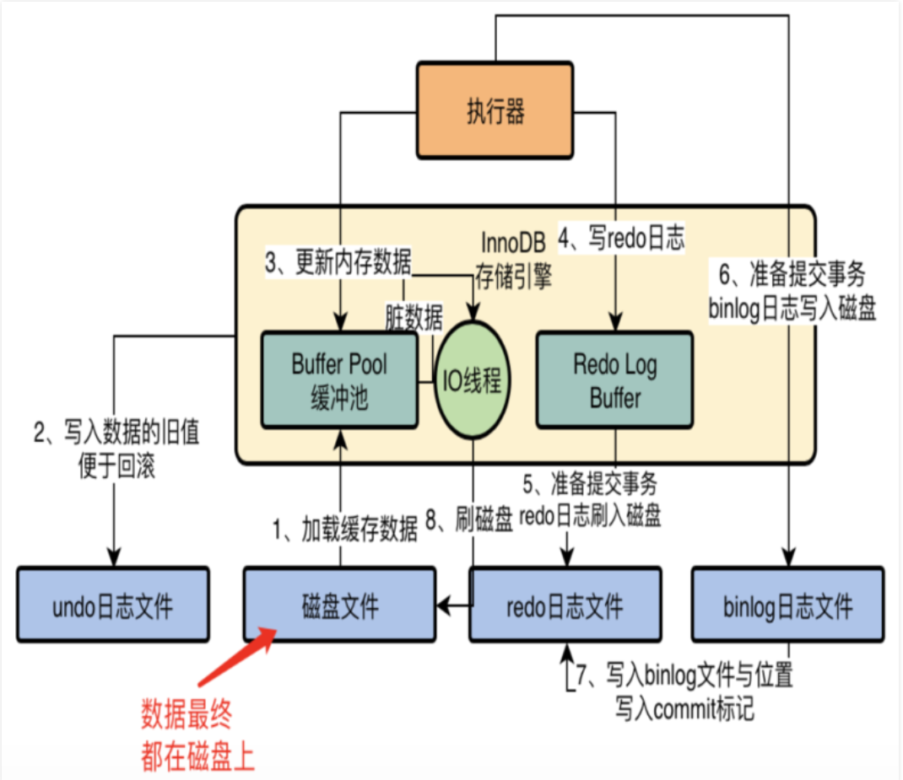

# acid

atomicity

- autocommit
- commit
- rollback

consistency

- crash recovery
- doublewrite buffer

isolation

- autocommit
- isolation level
- lock

durability

- doublewrite
- innodb_fulsh_log_at_trx_commit
- sync_binlog
- innodb_file_per_table
- ......

# 总图

# 内存结构

## buffer pool

- lru list ， 通过变种lru算法存放数据页

防止缓存污染：midpoint 点（记住3/8和5/8），及innodb_old_blocks_time 

- free list ， 管理buffer pool的空闲页
- flush list ， 管理需要被刷盘的脏页

## change buffer

**对象：非唯一的索引。**

​      对于这类索引的操作，先判断操作索引页是否在缓冲池中.如果在,则直接修改,如果不在,则先放入一个插入缓冲区中.然后再以一定的频率执行插入缓冲的合并操作.

**好处：**

​		不用每次都进行插入/更新/删除操作都进行io，更新索引到磁盘中。而且如果某些索引是发生在同一页上的，那效果更好。减少io。

**为什么针对非唯一索引：**

​       唯一索引会进行唯一性检查，索引页即使不在缓冲池中，也会将页读取到内存，因此还是会进行io操作。

## adaptive hash index

mysql会根据需要自动加入，比如在联表查询时，通过通过驱动表的id到被驱动表找数据时，使用自适应哈希索引能有效提高性能。

## log buffer

无

# 磁盘结构

## doublewrite buffer

场景：写redolog（16kB）到磁盘（4KB），写一半宕机了，数据页损坏。

写redolog的同时，写到doublewrite buffer，写在该buffer上的数据会马上被写入到磁盘文件。

## redo log

- 为什么要redo log

是innodb独有的，如果没有redo log，那就是直接该内存的数据页，一旦数据库宕机，数据页没有刷盘，就会导致数据丢失。而写入redo log，可以保证内存数据被持久化，同时写redo log是顺序写，效率高。

- redo log 和bin log同步

两阶段提交，先写redolog，且标记为prepare。写binlog，commit，redolog标记为commit。

## undo log

https://dev.mysql.com/doc/refman/5.7/en/innodb-multi-versioning.html  （官方）

https://www.cnblogs.com/jtjs1989/p/11101492.html （翻译）

https://www.cnblogs.com/zrzct/p/14192093.html （解读）

- 实现事务回滚
- 实现读一致性（读快照）