# 模块

nginx -V 的参数

以 --with 一直到 --with-cc-opt 都是nginx编译时开启或关联的模块

## http_stub_status_module

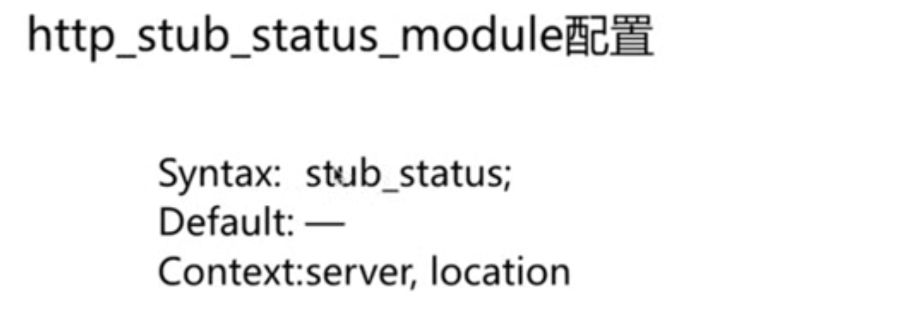

配置如下：

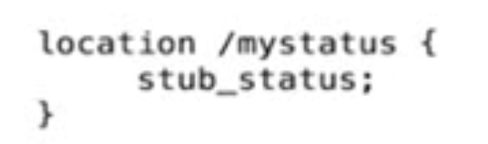

用于获取nginx的握手数、连接数，正在读，正在写，等待中的连接

## http_random_index_module

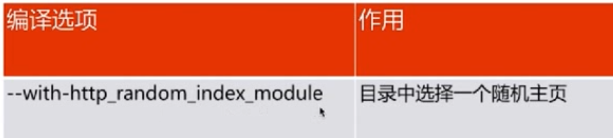

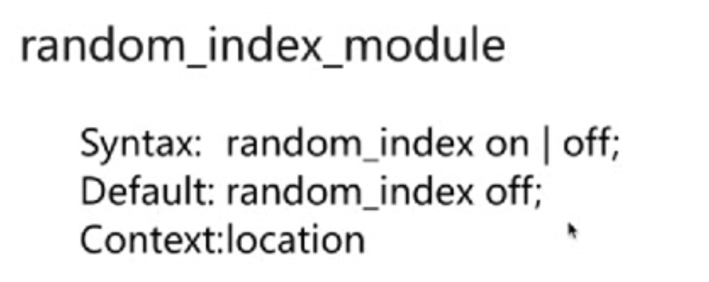

## http_sub_module

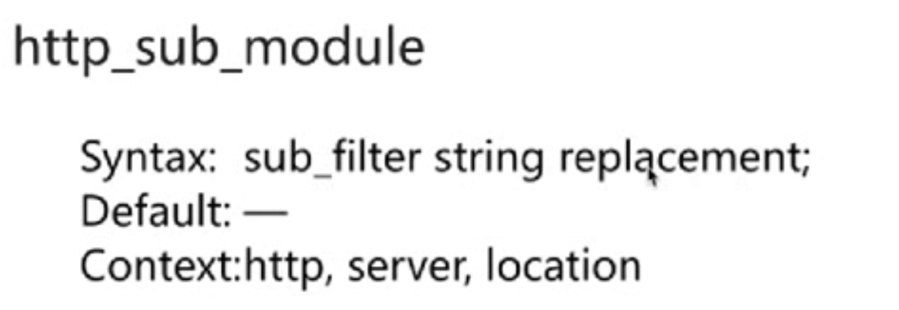

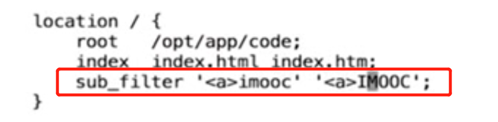

以上将把返回的页面的内容中第一个字符串\<a>imooc 替换成 \<a>IMOOC

配置 sub_filter_once off，则替换所有。

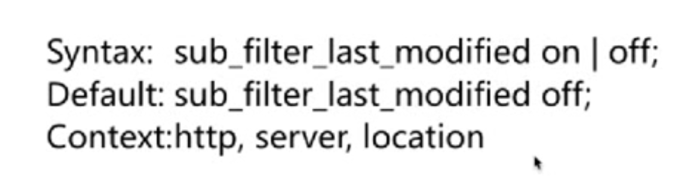

## 请求、连接限制

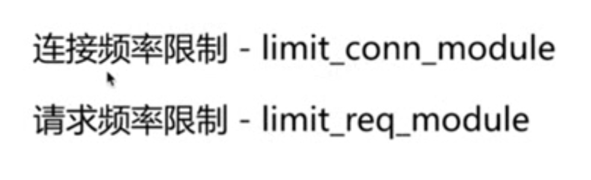

 ### 连接限制

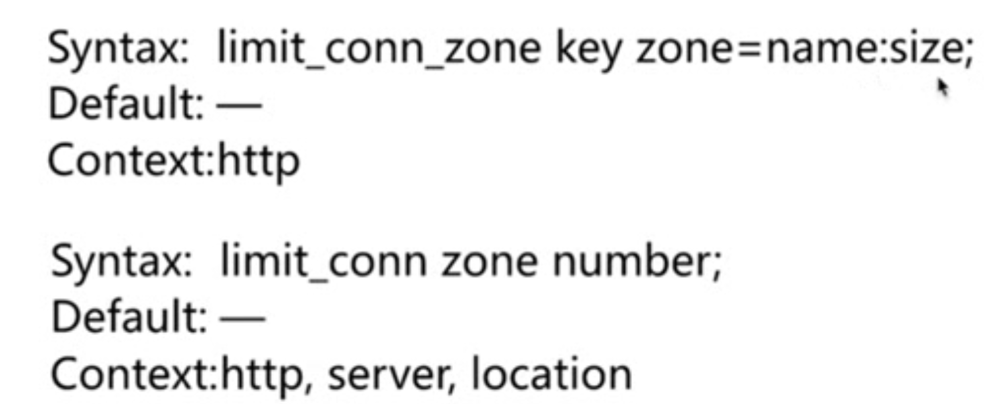

### 请求限制

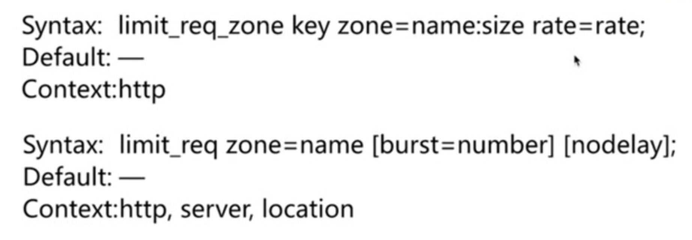

### 用例

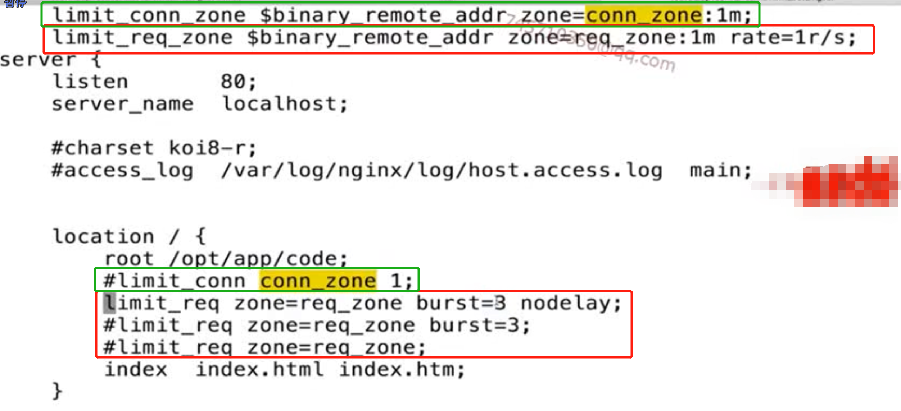

配置完通过ab -n 40 -c 20 http:/xxx/test.html 发起40个请求，20个并发。进行测试。

绿色是连接限制，通过客户端ip的二进制作为限制条件，只允许一个连接。

红色是请求限制，通过客户端二进制ip进行限制，限制为每秒一个请求。burst是指延迟处理。

## 访问控制

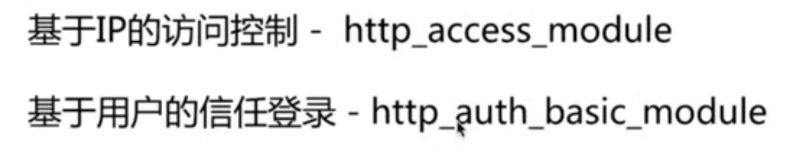

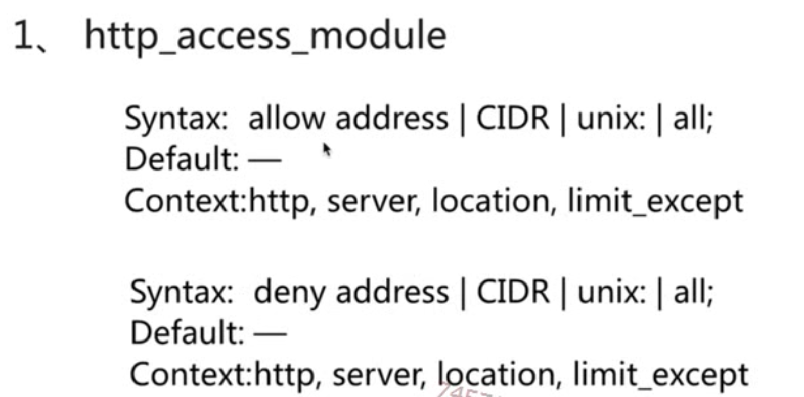

address：ip地址     cidr：网段：121.36.15.0/24     unix：socket    all：所有

### 局限

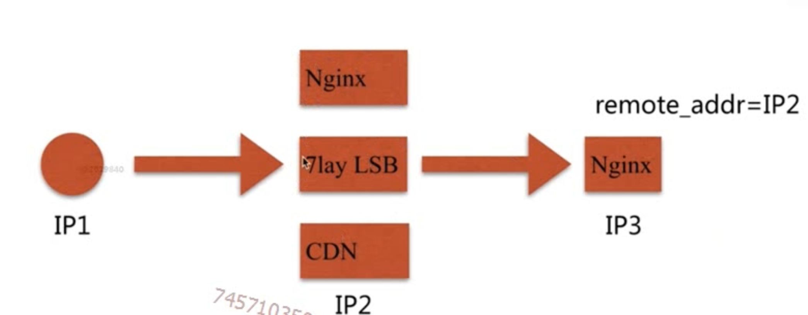

### 解决

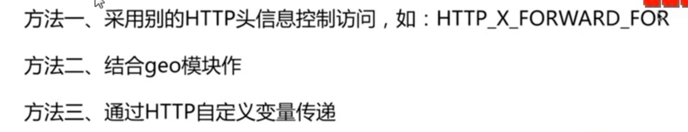

具体等后续

## 认证模块

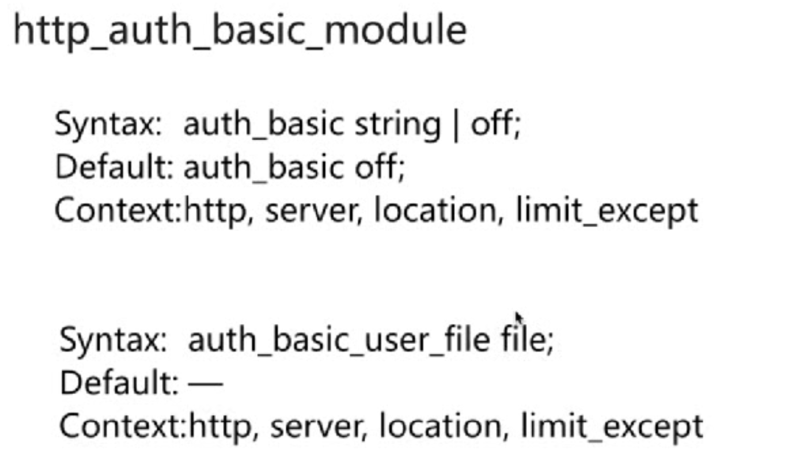

使用：https://nginx.org/en/docs/http/ngx_http_auth_basic_module.html

### 局限

依赖密码文件。管理低下。

### 解决

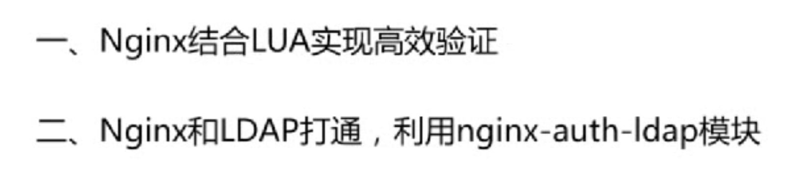

