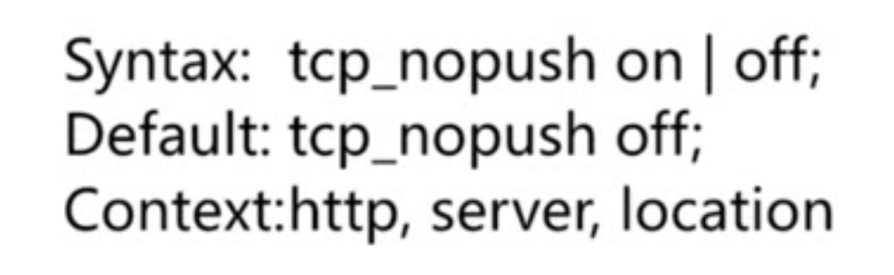

# 静态资源web服务

## 静态资源获取配置

todo

文件读取：

提高网络包的传输效率（sendfile开启下，大文件下）：

keepalive连接下，提高网络包的传输实时性：

压缩：

## 扩展nginx的压缩模块

gzip_static ：需要自己预先将文件压缩成gzip格式，如：访问1.png，需要预先压缩成 1.png.gz ，然后访问时，nginx会去读gz文件。

## 案例

## 浏览器缓存

last-modified：上次修改时间，单位为s。

Etag：一连串字符串

## 案例

  

请求时，请求头：max-age=0 浏览器自己加的，每一次都要去校验

## 跨域访问

todo

在当前域名的网页下，访问另一个域名的接口。

跨站：应该是协议、域名、端口有不一致，就算跨站。

## 案例

## 防盗链

防止资源被盗用

- 基于http_refer防盗链配置 （简单的设置）

使用curl进行验证 `curl -e "请求时的refer内容" -I "http://xxxx"` 

-I 表示只看头信息即可

-e 伪造请求头的refer值

# 代理服务

正向代理和反向代理

正向代理服务于客户端，隐藏客户端信息，去访问服务端信息。

反向代理服务于服务端，客户端不知道服务端信息，由代理去完成请求。

## 反向代理（todo）

## 正向代理

一台nginx a配置只允许某个ip访问

一台nginx b配置代理到nginx b

编写域名需要dns解析，配置的谷歌的dns

然后本地配置host，去访问nginxb， 由nginx获取到请求的host（域名）和请求的uri（路径），然后再代理到真正的nginx a中

## 其他（todo）

# 负载均衡调度器SLB

## 服务状态

验证时，可以使用iptable来使某些端口不提供服务。

`ipttables -I INPUT -p tcp --dport 8003 -j DROP`

## 调度算法

### ip_hash

remote_addr 

缺陷：如果有多层代理，则该ip不是客户的ip，而是代理机器的ip

### url_hash

这个request_uri包含了请求参数，如果想对参数进行hash，通过正则提取出来，再进行hash

# 动态缓存

服务端缓存：redis，memcache，内存

代理缓存：nginx

客户端缓存：浏览器

缓存过期周期

缓存维度

## 案例

## 清理缓存

- rm -rf 缓存目录
- 第三方模块  ngx_cache_purge

## 部分页面不缓存

# 大文件分片请求

todo

