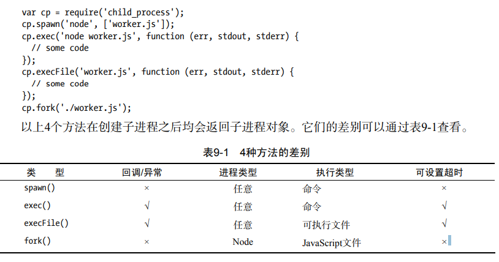
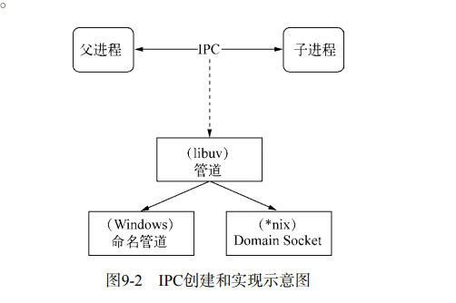

用户代码会运行在单进程的单线程上

- 如果单线程异常没有被捕获，将引起真个进程奔溃。
- 同时单进程无法充分利用cpu资源。

node通过异步io和事件驱动，使得在单进程单线程便能够支撑高并发。而创建子进程是为了充分利用cpu资源和保证系统健壮。

# 创建子进程



JavaScript文件通过execFile运行，它的首行内容必须添加如下代码：

`#!/usr/bin/env node`

# 进程间通信

```js
// parent.js
var cp = require('child_process');
var n = cp.fork(__dirname + '/sub.js');
n.on('message', function (m) {
 console.log('PARENT got message:', m);
});
n.send({hello: 'world'});

// sub.js
process.on('message', function (m) {
 console.log('CHILD got message:', m);
});
process.send({foo: 'bar'}); 
```

父子进程通过事件监听机制实现通讯。其底层是IPC （Inter-Process Communication）

进程间通讯。

node实现ipc通道是使用管道技术（抽象称呼），具体是由libuv实现，在windows下由命名管道实现，在*nix系统采用unix domain socket实现。而在应用层表现为简单的message和send。



父进程创建子进程之前，会先创建ipc通道并监听，然后才创建出子进程，并通过环境变量（NODE_CHANNEL_FD）告诉子进程这个ipc的文件描述符。子进程启动后通过描述符链接这个ipc通道，进而完成链接。

这个连接属于双向，同时在node中ipc通道被抽象成stream对象，因此send和message事件就像事件监听机制一样。

**只有进程类型是node，子进程才会根据环境变量去连接ipc通道，除非其他进程也按照约定去连接这个已经创建好的ipc通道。**

# 多个进程监听同个端口

开启多个进程，多个进程之间协调工作，就可以通过如下方法：

- 监听同个端口，抢占式服务。
- 通过代理。

父进程fork多个子进程，子进程监听同个端口，报错。

```js
//sub.js
var http = require('http'); 
http.createServer(function (req, res) { 
 res.writeHead(200, {'Content-Type': 'text/plain'}); 
 res.end('Hello World\n'); 
}).listen(8888, '127.0.0.1');
```

解决：

- master监听80端口，子进程监听不同的端口，然后通过代理将master接收到的连接代理到不同的子进程上。缺点：每接收到连接，就会用掉一个文件描述符，那么master用掉一个，代理到子进程又用掉一个，因此会浪费两个文件描述符。
- node提供了发送句柄，句柄用来标识服务端的socket对象、客户端的socket、udp套接字、管道等。master监听端口后，将tcp对象以句柄的形式传递给子进程。然后关闭掉自己的tcp对象。而子进程都可用拿到这个tcp对象，进而监听到同一个端口。

```js
// parent.js 
var cp = require('child_process'); 
var child1 = cp.fork('child.js'); 
var child2 = cp.fork('child.js'); 
// Open up the server object and send the handle 
var server = require('net').createServer(); 
//master完成监听后，将tcp对象以句柄的形式发送给子进程
server.listen(1337, function () { 
 child1.send('server', server); 
 child2.send('server', server); 
 // 发送完，关闭自己的监听
 server.close(); 
}); 

// child.js 
var http = require('http'); 
var server = http.createServer(function (req, res) { 
 res.writeHead(200, {'Content-Type': 'text/plain'}); 
 res.end('handled by child, pid is ' + process.pid + '\n'); 
}); 
//子进程收到master发送的tcp对象后，监听连接，有连接则触发到http。
process.on('message', function (m, tcp) { 
 if (m === 'server') { 
 tcp.on('connection', function (socket) { 
 server.emit('connection', socket); 
 }); 
 } 
});
```

疑惑：为什么多个子进程能监听同个端口，为什么多个子进程监听同个端口后，有连接时，不是所有子进程都触发连接。

解答：

1.

- 独立启动的进程中，创建的tcp服务器，它所拥有的socket套接字的文件描述符并不同，因此监听同个端口会抛出异常。
- node底层对每个端口都设置了SO_REUSEADDR，不同进程可以就相同的网卡和端口进行监听，即这个服务器端的套接字可以被不同的进程复用。
- 综上两点，独立启动的进程，套接字完全不一样，而通过ipc传输tcp对象（实际上发送的是套接字的文件描述符），因此都是同一个套接字，所以多个进程能够复用。

2.

- 多个进程监听同个端口。文件描述符同一时间只能被某个进程所用，这些进程服务是抢占式的，只有一个进程能够抢到连接，并对这个请求进行服务。

# 稳定的集群

上述可以利用cpu资源，同时处理的客户端的连接。

- 性能问题
- 多个工作进程存活状态管理
- 工作进程平滑重启
- 配置或静态数据动态重新载入
- 其他细节

## 事件

```js
$ kill -l 
 1) SIGHUP 2) SIGINT 3) SIGQUIT 4) SIGILL 
 5) SIGTRAP 6) SIGABRT 7) SIGEMT 8) SIGFPE 
 9) SIGKILL 10) SIGBUS 11) SIGSEGV 12) SIGSYS 
13) SIGPIPE 14) SIGALRM 15) SIGTERM 16) SIGURG 
17) SIGSTOP 18) SIGTSTP 19) SIGCONT 20) SIGCHLD 
21) SIGTTIN 22) SIGTTOU 23) SIGIO 24) SIGXCPU 
25) SIGXFSZ 26) SIGVTALRM 27) SIGPROF 28) SIGWINCH 29) SIGINFO 30) SIGUSR1 31) SIGUSR2 

//node提供这些信号对应的信号事件，每个进程可以监听这些信号，做出对应的操作。
process.on('SIGTERM', function() { 
 console.log('Got a SIGTERM, exiting...'); 
 process.exit(1); 
}); 
console.log('server running with PID:', p
```

通过父子进程之间的相关事件，就可以在这些关系之间创建出需要的机制了。

## 自动重启

父进程通过监听exit事件，如果发生，则重新创建子进程。

**因为要重新起子进程，同时将套接字句柄发送给工作进程，因此master的server不能close，因此master还能接收连接。书上没有对此做出解释。**

```js
ar createWorker = function () { 
 var worker = fork(__dirname + '/worker.js'); 
 worker.on('exit', function () { 
 console.log('Worker ' + worker.pid + ' exited.'); 
 delete workers[worker.pid]; 
 //监听到子进程的exit事件，重新建立一个。
 createWorker(); 
 }); 
 // 句柄转发
 worker.send('server', server); 
 workers[worker.pid] = worker; 
 console.log('Create worker. pid: ' + worker.pid); 
};
```

子进程捕获bug，并停止接收新的连接，断开所有已连接，退出进程。

```js
process.on('uncaughtException', function() {
  console.log(process.pid + ' 捕获到错误');
  // 停止接收连接
  worker.close(function() {
    // 等所有连接断开，才终止
    console.log(process.pid + ' 关闭');
    process.exit(1);
  });
});
```

以上要等待所有连接都断开，因此需要等待60s。如果是程序存在bug，一直导致子进程停止接收连接，那么4个子进程都在等待断开连接，才发起exist事件。那么需要换种监听事件，或者通过信号的方式来立刻重启子进程，而非等待子进程发起exit才重启子进程。

```js
//worker.js
process.on('uncaughtException', function (err) { 
    //捕获到错误后，立即发送信号。
 process.send({act: 'suicide'}); 
 worker.close(function () { 
 process.exit(1); 
 }); 
});
```

```js
var createWorker = function () { 
 var worker = fork(__dirname + '/worker.js'); 
    // 监听信号
 worker.on('message', function (message) { 
 if (message.act === 'suicide') { 
 createWorker(); 
 } 
 }); 
    // exit事件只是删除引用。
 worker.on('exit', function () { 
 console.log('Worker ' + worker.pid + ' exited.'); 
 delete workers[worker.pid]; 
 }); 
 worker.send('server', server); 
 workers[worker.pid] = worker; 
 console.log('Create worker. pid: ' + worker.pid); 
};
```

## 限量重启

如果程序一直出现bug，那么一直重启进程，这很耗费资源。如果并发量大，服务器一直在重启进程。

每次重启前，都判断最近重启的10次的时间间隔，如果过短，则认为存在bug，因此抛出give up事件。

```js
// 重启ْ数
var limit = 10; 
// 时间单位
var during = 60000; 
var restart = []; 
var isTooFrequently = function () { 
 var time = Date.now(); 
 var length = restart.push(time); 
 if (length > limit) { 
	restart = restart.slice(limit * -1); 
 } 
 return restart.length >= limit && restart[restart.length - 1] - restart[0] < during; 
}; 
var workers = {}; 
var createWorker = function () { 
if (isTooFrequently()) { 
//触发giveup事件，标识集群没有任何进程服务。
 process.emit('giveup', length, during); 
 return; 
 } 
 var worker = fork(__dirname + '/worker.js'); 
 worker.on('exit', function () { 
 console.log('Worker ' + worker.pid + ' exited.'); 
 delete workers[worker.pid]; 
 }); 
 // 重启进程
 worker.on('message', function (message) { 
 if (message.act === 'suicide') { 
 createWorker(); 
 } 
 }); 
 // 句柄转发
 worker.send('server', server); 
 workers[worker.pid] = worker; 
 console.log('Create worker. pid: ' + worker.pid); 
};
```

## 负载

默认是抢占式，如果对于子进程是cpu繁忙，而其他子进程是io繁忙，那么io繁忙的更容器抢到连接。因为影响抢占的是cpu的繁忙度。在cluster模块中，使用Round-Robin，即轮询。


# cluster 模块

也是通过clild_process和net模块组合应用的。